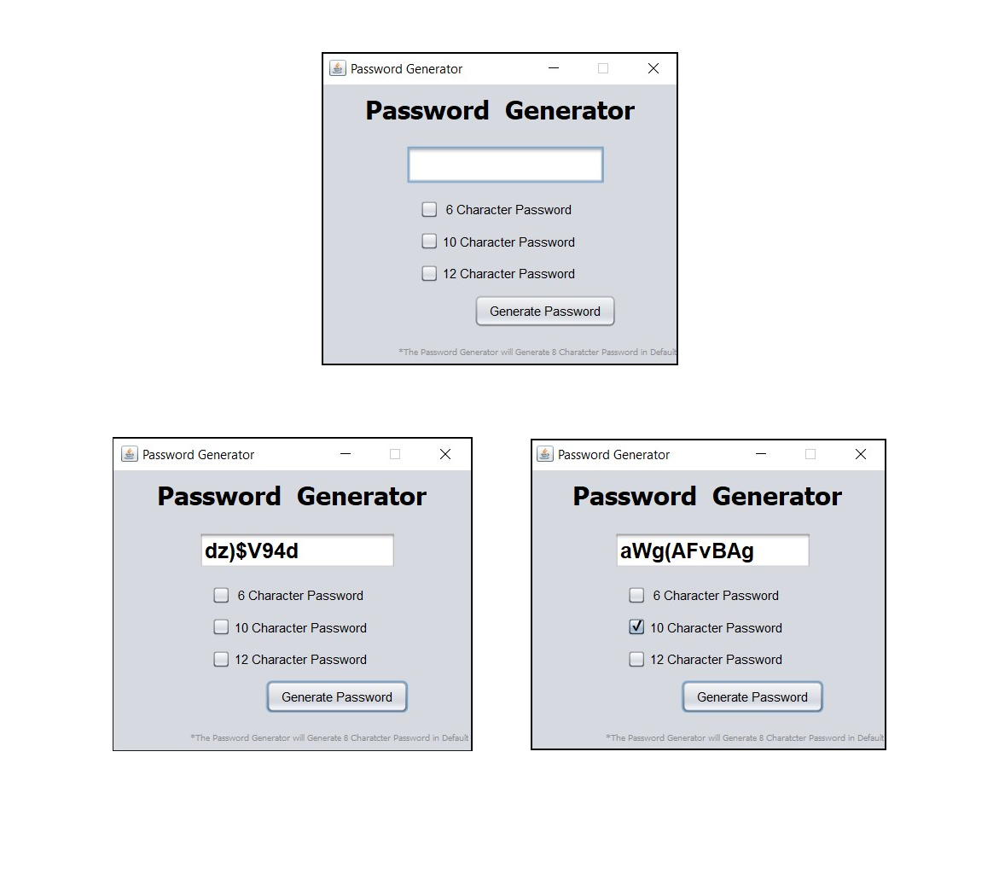

# Password-Generator
<h3>A password generator is a software tool that creates random or customized passwords for users. It helps users create stronger passwords that provide greater security for a given type of access.The Password Contains alphabets(a-z & A-Z),Numeric Characters(0-9) and Special Characters( $, #, @, !,%,^,&,*,(,)).</h3>

<h2>Swing (GUI) </h2>
<h3>Swing is a GUI widget toolkit for Java. It is part of Oracle's Java Foundation Classes (JFC) – an API for providing a graphical user interface (GUI) for Java programs.</h3>
<h4>For more</h4> https://www.geeksforgeeks.org/creating-frames-using-swings-java/

 <h2> AWT(Abstract Window Toolkit) </h2>
<h3>It is a platform dependent API for creating Graphical User Interface (GUI) for java programs.</h3>
<h4>For more</h4>https://www.javatpoint.com/java-awt
 
<h1 align="center">Application Screenshot</h1>

  

<h2>Drive Link for Password Generator Executable jar file</h2>
https://drive.google.com/file/d/1YNGkM5V3VlR04ZdgfDWfTxahUT2dHpKo/view?usp=sharing
